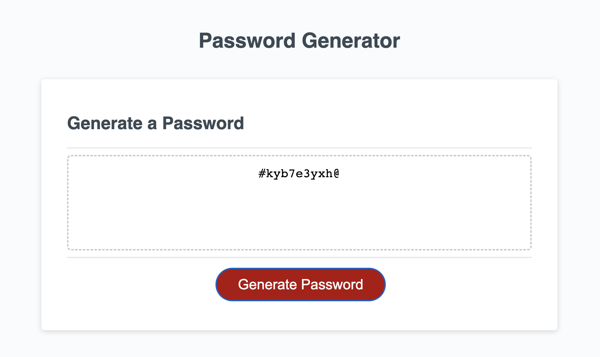

# 03-challenge-passworddgenerator

## Description

Random password generator - generates random password based upon user selection for various character types to be included.

## Usage

Website has been deployed using GitHub pages and can be reached through below link,
https://chandraucb.github.io/03-challenge-passworddgenerator/

Click Generate Password button to create password.
Application will prompt for various options whether to include uppercase, lowercase, numeric & special character and take length for password. At least one character type with a valid password length is required to create password. When all prompts are answered, new password will be displayed on the page. 

#Reference 
Crreate password was build based logic explain by below blog post link,
https://dev.to/code_mystery/random-password-generator-using-javascript-6a